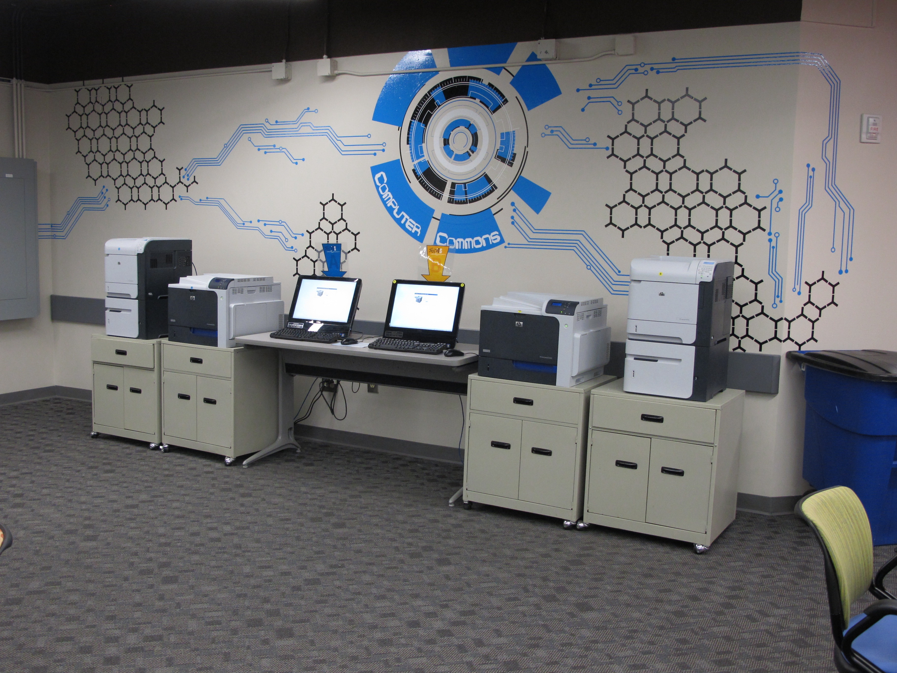
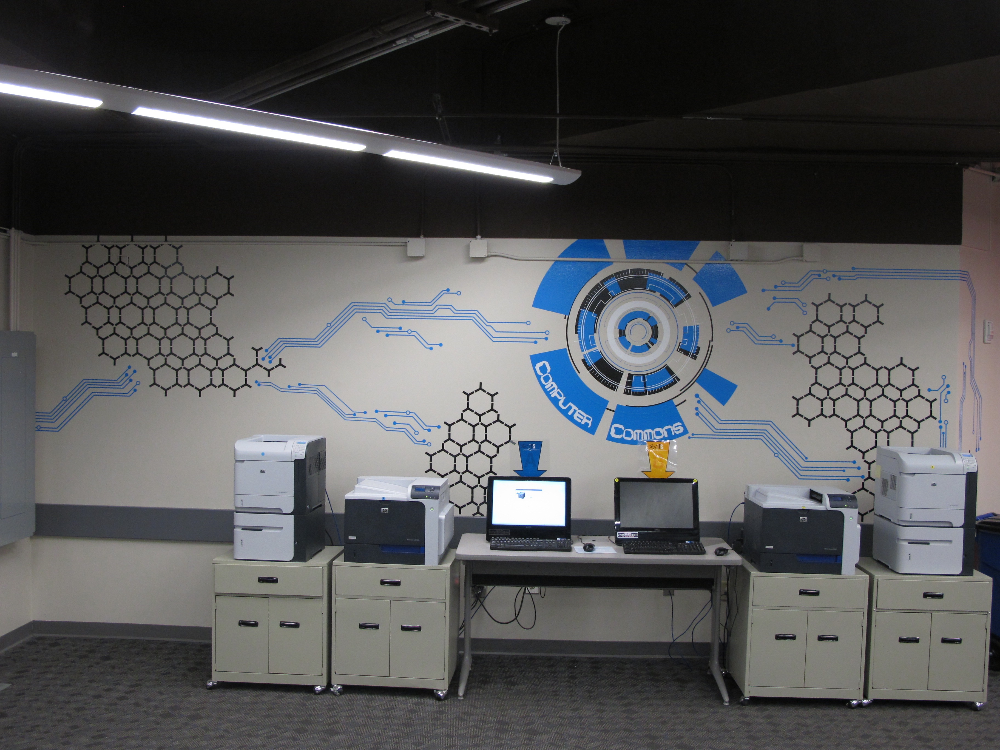
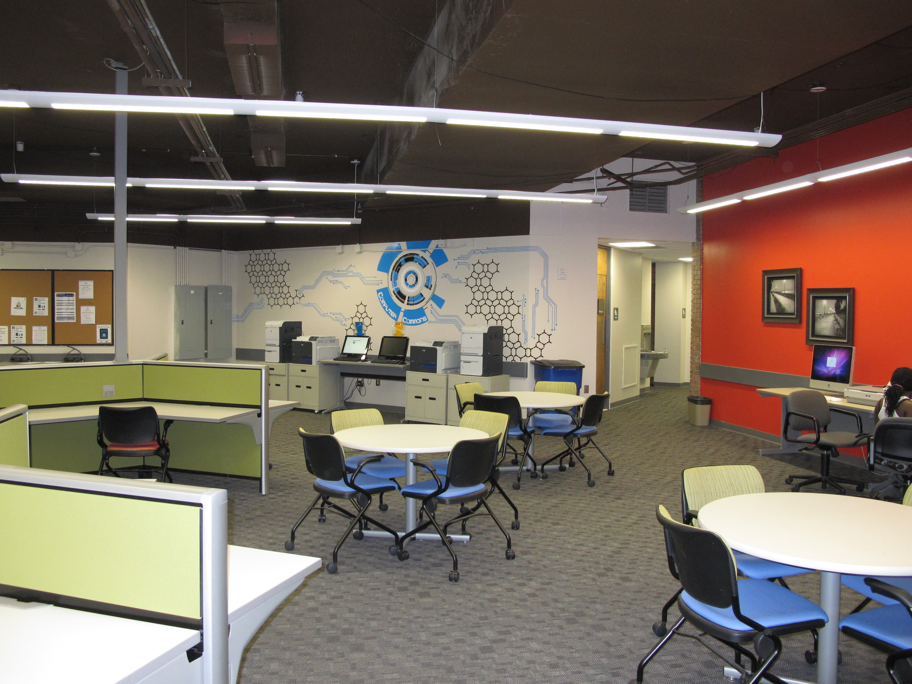

## Description

Lander University wanted an environmental design installation in their new computer commons. A fellow designer and I met with the heads of the IT department, discussed their expectations for the installation, and measured the space where they wanted it installed. We each came up with a couple of designs, taking inspiration from the various components in the commons area, and presented them to the heads for input and approval. The heads decided to use one of my proposed designs. Once we had the approval, we prepped the installation site, cut, peeled and installed the design in vinyl.

<figure class="individual">
    
</figure>

## After Photos

  <figure class='w30-percent'>
     
  </figure>
  <figure class='w30-percent'>
    
  </figure>
  <figure class='w30-percent'>
    
  </figure>

