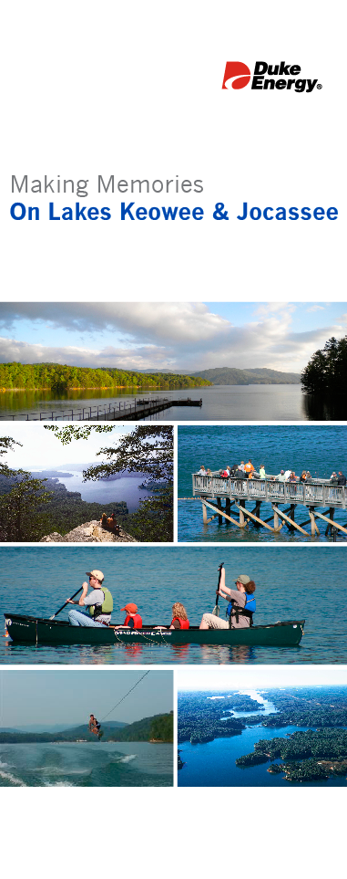
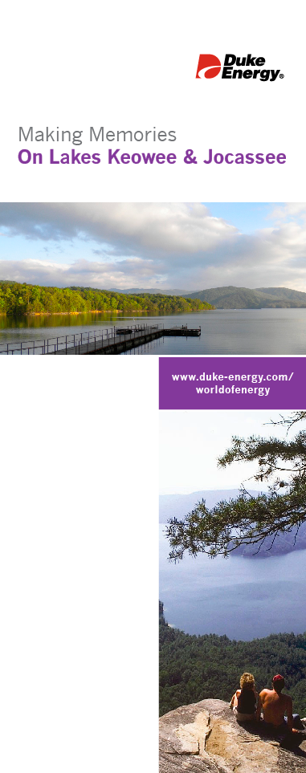
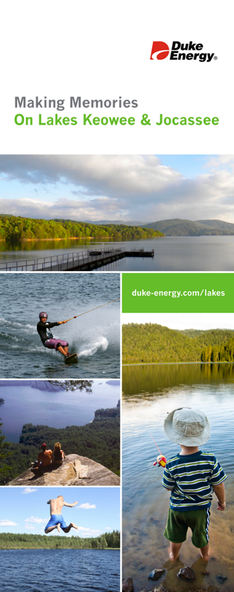
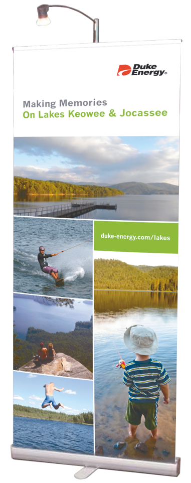

## Description

While at Skylines Exhibits & Designs, Duke Energy wanted new display pieces for one of their upcoming expos. I was given the opportunity by the Skyline's lead designer to come up with the design for a bannerstand to be presented to the client.

The client provided a photo gallery to select images from and a branding guideline for me to follow. They specified a particular image and tagline to be included in the design. Making sure I followed their branding, I sketched out a couple of initial ideas for the layout and worked with the lead designer to narrow them down to 3 different options. I created mock-ups for the options, using the provided photos, to get a better feel for each layout.

  <figure class='w30-percent'>
    <figcaption>Option 1</figcaption>
    
  </figure>
  <figure class='w30-percent'>
    <figcaption>Option 2</figcaption>
    
  </figure>
  <figure class='w30-percent'>
    <figcaption>Option 3</figcaption>
    
  </figure>

Once I had the mock-ups finalized, I gave them to the lead designer for his approval, who then included them with the presentation with the rest of the expo pieces. The client decided which of the options they liked and once they gave their final approval, I optimized the artwork to be sent to Skyline's corporate office to be printed and produced.

<figure class="individual w100-percent iw25-percent">
    
    <figcaption>Approved Bannerstand Design</figcaption>
</figure>
